# OPIN-VN Data Schema v0.2 (OPIN-grounded)

## What this is

This document renders the OPIN (Open Insurance Network) Data Standard v1.2.1 as a single internally-consistent entity-relationship reference, organised by twelve coverage and lifecycle modules. It is the data-side companion to the OPIN-VN API design document and is the data foundation for the Vietnam country adaptation track.

The document is OPIN-grounded. Every entity, field, and enum traces back to a sheet in the OPIN v1.2.1 data standard XLSX. Where the OPIN XLSX and the OPIN v1.0 API JSON diverge, this document treats the XLSX as authoritative and flags the divergence with `[OPIN concern]`. Where OPIN spelling, casing, or sheet naming carries a typo that is non-controversial to fix, this document applies an `[OPIN-VN normalisation]` and notes the original spelling so the upstream OPIN issue can be reported back.

There are no product-specific extensions in this document. Trisilva product schemas (ClaimFlow, MicroFlow, and the other InsureFlow family products) are not modelled here. Where OPIN is silent on a domain area that does not fit insurance natively (event streams, telematics ingestion, distribution channels, parametric oracles, breach notification timelines, microinsurance commission ledgers), this document marks the area as out-of-scope for OPIN rather than stretching OPIN to cover it.

The only OPIN-VN addition to the OPIN standard is **endpoint completion**: closing the gap between OPIN's full data standard and OPIN's partial v1.0 API specification. That work lives in the sibling document `opin-vn-api-design.md` and is not described here.

OPIN source (Google Sheets): https://docs.google.com/spreadsheets/d/1Y0Gk_LpTvTNEfoDMdIxeD7juv3E8FKcbE3mHUJNV5JY

OPIN source (XLSX): the public v1.2.1 data standard workbook published by the Open Insurance Initiative at the sheet linked above.

OPIN API source (v1.0): https://github.com/The-Open-Insurance-Initiative/API-spec/blob/main/Open-Insurance-io-Open_Insurance_API-1.0-resolved.json

Mermaid syntax reference: https://mermaid.js.org/intro/

`[OPIN concern]` discipline: OPIN's data standard is comprehensive across coverage types but the OPIN API specification is structurally three-tiered relative to the data standard: (a) the motor module is fully covered with entity schemas and CRUD endpoints; (b) cross-cutting entities (parties, products, premium, receipts, claims) have entity schemas but no endpoints; (c) non-motor coverage modules (travel, term life, cyber, property, BI, trade credit, pet) have only enum support, with no entity schemas and no endpoints. Endpoint completion is an OPIN-VN concern handled in the sibling API doc.

`[OPIN concern]`: The OPIN data standard XLSX (v1.2.1) and the OPIN API JSON (v1.0) are internally inconsistent. `termLifeType` has 4 values in the XLSX but only 3 in the API JSON. `termLifeRiders` has 4 values in the XLSX and 5 in the API JSON. The API also contains a typo: enum named `rootConstruction` should be `roofConstruction` to match the XLSX. This document treats the XLSX as authoritative and flags the API as stale where they diverge. A future v1.0 of this track must resolving these upstream with the OPIN initiative.

---

## Module index

1. [Core Parties and Entities](#module-1-core-parties-and-entities)
2. [Products and Catalog](#module-2-products-and-catalog)
3. [Motor](#module-3-motor)
4. [Travel](#module-4-travel)
5. [Term Life](#module-5-term-life)
6. [Property](#module-6-property)
7. [Cyber Liability](#module-7-cyber-liability)
8. [Business Interruption](#module-8-business-interruption)
9. [Trade Credit](#module-9-trade-credit)
10. [Pet](#module-10-pet)
11. [Claims](#module-11-claims)
12. [Premium and Receipts](#module-12-premium-and-receipts)
13. [Cross-module composite view](#cross-module-relationships-composite-view)
14. [Open OPIN questions](#open-opin-questions)

---

## Module 1: Core Parties and Entities

Covers the universal party types across every coverage line: insurer or intermediary entities, retail customers, commercial customers, beneficiaries, and the underlying address structure.

OPIN sources: `InsuranceEntity`, `Personal`, `Commercial`, `Beneficiary`, `address`, `legalEntity`, `entityType`, `entityClassification`, `salutation`, `gender`, `idType`.

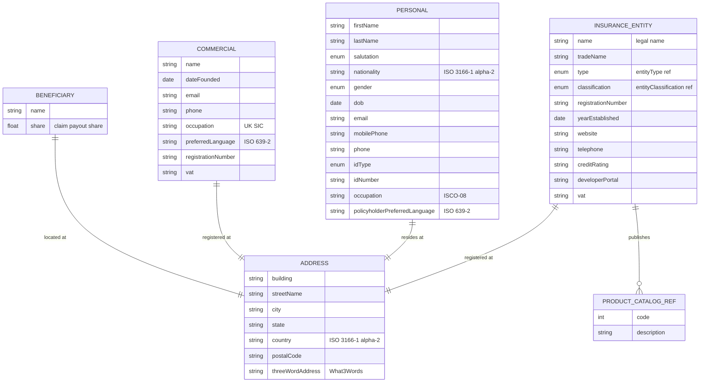

### Field annotations (Module 1)

| Entity | Field | Type | OPIN source | Notes |
|---|---|---|---|---|
| InsuranceEntity | name | Text | sheet `InsuranceEntity` | Required for issuer identification |
| InsuranceEntity | tradeName | Text | sheet `InsuranceEntity` | Optional |
| InsuranceEntity | type | enum (entityType) | sheet `entityType` | 17 values: reinsurance, takaful, mutual, P2P, Lloyd's, broker, agent, MGA, etc. |
| InsuranceEntity | classification | enum (entityClassification) | sheet `entityClassification` | P&C / life / composite / other |
| InsuranceEntity | registrationNumber | Text | sheet `InsuranceEntity` | Regulator-issued |
| InsuranceEntity | yearEstablished | Date (ISO 8601) | sheet `InsuranceEntity` |  |
| InsuranceEntity | address | ref (address) | sheet `InsuranceEntity` |  |
| InsuranceEntity | website | Text/URL | sheet `InsuranceEntity` |  |
| InsuranceEntity | telephone | Text | sheet `InsuranceEntity` |  |
| InsuranceEntity | creditRating | Text | sheet `InsuranceEntity` | S&P, AM Best, Fitch |
| InsuranceEntity | developerPortal | Text/URL | sheet `InsuranceEntity` |  |
| InsuranceEntity | productCatalog | ref (productCatalog) | sheet `InsuranceEntity` | Multi-valued |
| InsuranceEntity | vat | Text | sheet `InsuranceEntity` |  |
| Personal | firstName | Text | sheet `Personal` |  |
| Personal | lastName | Text | sheet `Personal` |  |
| Personal | salutation | enum | sheet `salutation` | Mr / Mrs / Ms |
| Personal | nationality | Text (ISO 3166-1 alpha-2) | sheet `Personal` |  |
| Personal | gender | enum | sheet `gender` | m / f / o |
| Personal | dob | Date (ISO 8601) | sheet `Personal` |  |
| Personal | email | Text | sheet `Personal` |  |
| Personal | mobilePhone | Text | sheet `Personal` |  |
| Personal | phone | Text | sheet `Personal` |  |
| Personal | address | ref (address) | sheet `Personal` |  |
| Personal | idType | enum | sheet `idType` | passport / national id / driving licence / NI / other |
| Personal | idNumber | Text | sheet `Personal` |  |
| Personal | occupation | Text (ISCO-08) | sheet `Personal` |  |
| Personal | policyholderPreferredLanguage | Text (ISO 639-2) | sheet `Personal` |  |
| Commercial | name | Text | sheet `Commercial` |  |
| Commercial | registeredAddress | ref (address) | sheet `Commercial` |  |
| Commercial | dateFounded | Date (ISO 8601) | sheet `Commercial` |  |
| Commercial | email | Text | sheet `Commercial` |  |
| Commercial | phone | Text | sheet `Commercial` |  |
| Commercial | occupation | Text (UK SIC) | sheet `Commercial` |  |
| Commercial | preferredLanguage | Text (ISO 639-2) | sheet `Commercial` |  |
| Commercial | registrationNumber | Text | sheet `Commercial` |  |
| Commercial | vat | Text | sheet `Commercial` |  |
| Beneficiary | name | Text | sheet `Beneficiary` | Person or entity |
| Beneficiary | address | ref (address) | sheet `Beneficiary` |  |
| Beneficiary | share | Number/Float | sheet `Beneficiary` | Share in claim payout |
| Address | building | Text | sheet `address` |  |
| Address | streetName | Text | sheet `address` |  |
| Address | city | Text | sheet `address` |  |
| Address | state | Text | sheet `address` |  |
| Address | country | Text (ISO 3166-1 alpha-2) | sheet `address` |  |
| Address | postal_code | Text | sheet `address` | Underscore in OPIN sheet; rendered here as `postalCode` for camelCase consistency |
| Address | 3_word_address | Text (What3Words) | sheet `address` | Underscore-with-leading-digit in OPIN sheet; rendered here as `threeWordAddress` |

`[OPIN concern]`: `Personal.gender` enum is binary plus `other` (m / f / o). OPIN does not address gender-neutral salutations. Some jurisdictions require additional values or a different non-binary representation. This track should review whether VN regulations require additional values before publication.

`[OPIN concern]`: `Commercial` lacks an explicit `legalForm` reference to the `legalEntity` enum that Trade Credit's `Debtor` entity uses. The sheet defines the `legalEntity` enum but does not surface it on `Commercial`, leaving commercial-policyholder legal form unmodelled outside trade credit. Upstream candidate.

`[OPIN concern]`: The `address` sheet uses `postal_code` and `3_word_address` (underscore-prefixed digit) as field names, which break camelCase conventions used elsewhere in OPIN. `[OPIN-VN normalisation]` applied: rendered as `postalCode` and `threeWordAddress`.

---

## Module 2: Products and Catalog

Covers the policy-level Product entity that every coverage shares: lineOfBusiness reference, product model (conventional, PAYD, PHYD, subscription, government tariff, other), contract type (not automated, smart contract, parametric, other), and currency.

OPIN sources: `Product`, `productCatalog`, `productModel`, `contractType`, `policyWording`, `currency`, `paymentMethod`, `premiumPaymentFrequency`, `endorsementType`, `policyStatus`.

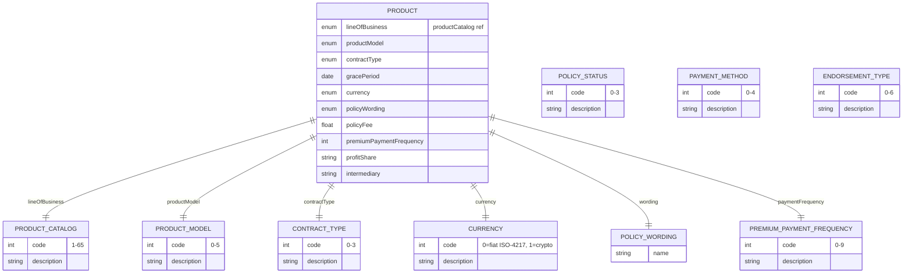

### Field annotations (Module 2)

| Entity | Field | Type | OPIN source | Notes |
|---|---|---|---|---|
| Product | lineOfBusiness | enum (productCatalog) | sheet `Product` | 65 distinct insurance product types |
| Product | productModel | enum | sheet `productModel` | conventional annual / PAYD / PHYD / subscription / government tariff / other |
| Product | contractType | enum | sheet `contractType` | not automated / smart contract / parametric / other |
| Product | gracePeriod | Date | sheet `Product` | Policy lapse date |
| Product | currency | enum | sheet `currency` | fiat (ISO-4217) or cryptocurrency |
| Product | policyWording | ref (policyWording) | sheet `policyWording` | Market-specific name |
| Product | policyFee | Number/Float | sheet `Product` | Admin fees |
| Product | premiumPaymentFrequency | enum (premiumPaymentFrequency) | sheet `premiumPaymentFrequency` |  |
| Product | profitShare | Text | sheet `Product` | Formula |
| Product | intermediary | Text | sheet `Product` | Broker/agent name |
| ProductCatalog | code | int | sheet `productCatalog` | 1-65 enumeration covering motor, property, marine, medical, engineering, life, cyber, BI, trade credit, pet, travel, etc. |
| ProductModel | code | int | sheet `productModel` | 0-5 |
| ContractType | code | int | sheet `contractType` | 0-3 |
| PolicyStatus | code | int | sheet `policyStatus` | in force / cancelled / lapsed / extended |
| EndorsementType | code | int | sheet `endorsementType` | addition / deletion / cancellation / extension / declaration / transfer / renewal |
| PaymentMethod | code | int | sheet `paymentMethod` | cash / credit card / cheque / electronic transfer / crypto |
| PremiumPaymentFrequency | code | int | sheet `premiumPaymentFrequency` | 0-9: annual, bi-annual, quarterly, monthly, bi-monthly, weekly, daily, usage-based, subscription, other |

`[OPIN concern]`: `policyWording` is defined as a single-property entity with just `name`. OPIN does not specify version control, effective date, or wording document URL for the underlying policy text. Compliance traceability and reissuance handling are not supported. Upstream candidate.

`[OPIN concern]`: `productCatalog` (65 entries) does not include parametric weather, index-linked microinsurance, or microinsurance-specific products explicitly. Parametric and index-linked products map only loosely to existing codes (e.g., 36 purchase protection or 30 personal accident). Upstream candidate for OPIN to consider whether parametric variants merit dedicated codes.

`[OPIN concern]`: `Product.premiumPaymentFrequency` is typed `Number/integer` on the `Product` sheet but references the `premiumPaymentFrequency` enum. Type vs reference inconsistency. The enum is authoritative; type should be `enum`.

---

## Module 3: Motor

Covers motor insurance: Vehicle (the most data-rich entity in OPIN, with 100+ properties spanning registration, OEM, telematics, ADAS, and condition signals), Driver, motorCoverage, and motor-specific perils.

OPIN sources: `motorCoverage`, `Vehicle`, `Driver`, `motorPeril`, `bodyType`, `fuelType`, `aiClassification`, `vehicleUse`, `drivingLicence`, `conviction`, `offenceCode`, `medicalCondition`, `workStatus`, `notifiableCondition`, `distanceUnit`.

```mermaid
erDiagram
    MOTOR_COVERAGE {
        string policyNumber
        datetime inceptionDate "ISO 8601"
        datetime expiryDate "ISO 8601"
        enum status "policyStatus ref"
        float discountAmount
        float premiumRate
        float grossWrittenPremium
        float salesTax
        float brokeragePercentage
        float brokerageAmount
        int premiumPaymentFrequency
        int indemnityLimitPolicy
        int indemnityLimitAccident
        bool isAgreedValue
        string endorsementID
        datetime endorsementDate
        enum endorsementType
        enum peril "motorPeril ref"
        float voluntaryDeductiblePercentage
        int voluntaryDeductibleAmount
        float compulsoryDeductiblePercentage
        int compulsoryDeductibleAmount
        float windscreenDeductiblePercentage
        int windscreenDeductibleAmount
        enum distanceUnit
        float pleasureDistance
        float businessDistance
        int numberOfVehicles
    }
    DRIVER {
        string name
        enum gender
        date driverDOB
        bool isPrimaryDriver
        int noClaimsDiscount
        float loading "young driver loading"
        bool isBlueBadge
        string nonMotorConviction
        enum workStatus
        string occupation "ISCO-08"
    }
    DRIVING_LICENCE {
        string licenceNumber
        date issueDate
        date expiryDate
        string country "ISO 3166-1 alpha-2"
        string licenceCategory
        string licenceCodes
    }
    CONVICTION {
        date offenceDate
        enum offenceCode "offenceCode ref - DVLA UK"
        date date
        int points
        float fine
        enum fineCurrency "currency ref"
        bool suspension
        int suspensionLength
    }
    MEDICAL_CONDITION {
        enum notifiableCondition
        string status
        string medicalDvlaRestriction
        string medicalTreatment
        bool bypassOperation
        bool insulinInjected
        int dailyInsulinUnits
    }
    VEHICLE {
        string plateNumber
        date registrationDate
        string countryOfRegistration "ISO 3166-1 alpha-2"
        string chassisNumber
        string vin
        string engineNumber
        string vehicleWeight
        bool agencyRepair
        bool vehicleGarage
        enum bodyType
        enum fuelType
        enum aiClassification "SAE International"
        enum vehicleUse
        int yearlyMilage
        string vehicleBrand "KBA HSN/TSN"
        string vehicleModel
        date modelYear
        string seats
        string colour "ISO 14726"
        bool trailerIncluded
        int sumInsured
        string accessories
        int accessoryValue
        float engineCapacity "cc"
        bool co2Emissions
        bool automaticTransmission
        bool lefthandDrive
        bool blueBadgeAdapted
        int doors
        string securityDevice
        string modification
        bool digitalKeyUsed
        int power
        int torque
        int evPower "kilowatts"
        int evTorque
        string acceleration "0-60mph seconds"
        string vehicleTopSpeed
        bool hasTractionEnabled
        bool hasImmobilizer
        bool hasTheftDetection
        float currentMileage
        float currentMileageDynamic
        float yearlyMilageDynamic
        float highwayYearlyMilageDynamic
        float dailyMilageDynamic
        string serviceHistory
        bool serviceDue
        int timeToService
        string recallHistory
        bool tractionControlEngaged
        float accelerationLongitudinal
        float accelerationLateral
        float accelerationVertical
        float brakingFrequency
        float brakePedalForce
        float brakePedalSpeed
        bool performanceMode
        bool emergencyBraking
        bool engnitionOn
        bool engnitionOff
        float ignitionOnTime
        float ignitionOffTime
        float longitude
        float latitude
        float altitude
        float heading
        bool isMoving
        bool hornIsActive
        float drivingSpeed
        bool wheelSpin
        float decelrationRate
        float steeringSpeedTurn
        bool laneDepartureWarning
        bool adasAbsIsActive
        bool obstacleDetectionIsActive
        bool driverIntervention
        bool obstacleDetectionWarning
        float speedSet
        float yaw
        float pitch
        float roll
        float gForce
        bool row1Pos1Isbelted
        bool row1Pos2Isbelted
        bool row2Pos1Isbelted
        bool row2Pos2Isbelted
        float cabinTemp
        float cabinHumidity
        string tireConditionRow1Left
        string tireConditionRow1Right
        string tireConditionRow2Left
        string tireConditionRow2Right
        float tirePressureRow1Left
        bool tirePressureRow1LeftLow
        float brakePadWearRow1Left
        bool brakesWornRow1Right
        float clutchWear
        bool hasAirbagDeployed
        bool hasAbsError
        bool engineWarning
        string knownVehicleDamage
        string damagedParts
        float damagedPartsCost
        int occupiedSeats
        bool childSeatOccupiesSeat
        bool consentGranted
    }
    MOTOR_PERIL {
        int code "0-16, seventeen values"
        string description
    }

    MOTOR_COVERAGE ||--|{ DRIVER : "covers"
    MOTOR_COVERAGE ||--|{ VEHICLE : "insures"
    DRIVER ||--|| DRIVING_LICENCE : "holds"
    DRIVER ||--o{ CONVICTION : "has"
    DRIVER ||--o{ MEDICAL_CONDITION : "has"
    MOTOR_COVERAGE ||--|{ MOTOR_PERIL : "covers"
```

### Field annotations (Module 3)

| Entity | Field | Type | OPIN source | Notes |
|---|---|---|---|---|
| MotorCoverage | policyNumber | Text | sheet `motorCoverage` |  |
| MotorCoverage | inceptionDate | DateTime (ISO 8601) | sheet `motorCoverage` |  |
| MotorCoverage | expiryDate | DateTime (ISO 8601) | sheet `motorCoverage` |  |
| MotorCoverage | status | enum (policyStatus) | sheet `motorCoverage` |  |
| MotorCoverage | premiumRate | Number/Float | sheet `motorCoverage` | Percentage |
| MotorCoverage | grossWrittenPremium | Number/Float | sheet `motorCoverage` | Pre-tax premium and acquisition costs |
| MotorCoverage | indemnityLimitPolicy | Number/integer | sheet `motorCoverage` | Annual policy limit |
| MotorCoverage | indemnityLimitAccident | Number/integer | sheet `motorCoverage` | Per-accident limit |
| MotorCoverage | peril | enum (motorPeril) | sheet `motorPeril`, API enum `motorPeril` | 17 values: TPL, fire, theft, accidental damage, windshield damage, malicious damage, terrorism and sabotage, flood, earthquake, volcanic eruption, tsunami, hail, unknown or hit-and-run, riots, strikes, civil commotion, war |
| MotorCoverage | voluntaryDeductibleAmount | Number/integer | sheet `motorCoverage` |  |
| MotorCoverage | compulsoryDeductibleAmount | Number/integer | sheet `motorCoverage` |  |
| MotorCoverage | windscreenDeductibleAmount | Number/integer | sheet `motorCoverage` |  |
| MotorCoverage | distanceUnit | enum (distanceUnit) | sheet `motorCoverage` | km / miles |
| MotorCoverage | pleasureDistance | Number/Float | sheet `motorCoverage` | PAYD support |
| MotorCoverage | businessDistance | Number/Float | sheet `motorCoverage` | PAYD support |
| Driver | name | Text | sheet `Driver` |  |
| Driver | driverDOB | Date | sheet `Driver` |  |
| Driver | isPrimaryDriver | Boolean | sheet `Driver` |  |
| Driver | licence | ref (drivingLicence) | sheet `Driver` |  |
| Driver | noClaimsDiscount | Number/integer | sheet `Driver` | Years of NCB |
| Driver | conviction | ref (conviction) | sheet `Driver` | Multi-valued |
| Driver | medicalCondition | ref (medicalCondition) | sheet `Driver` | OPIN spelling `medicalConditon` on Driver sheet; `[OPIN-VN normalisation]` applied |
| Driver | loading | Number/Float | sheet `Driver` | Young driver % loading |
| Driver | isBlueBadge | Boolean | sheet `Driver` | UK accessibility scheme |
| Driver | workStatus | enum (workStatus) | sheet `workStatus` | self-employed / retired / employed / redundant |
| Vehicle | plateNumber | Text | sheet `Vehicle` |  |
| Vehicle | countryOfRegistration | Text (ISO 3166-1 alpha-2) | sheet `Vehicle` | OPIN spelling `countryOfRegisteration`; `[OPIN-VN normalisation]` applied |
| Vehicle | vin | Text | sheet `Vehicle` | Standard VIN |
| Vehicle | bodyType | enum | sheet `bodyType` | 12 values from motor car to construction equipment |
| Vehicle | fuelType | enum | sheet `fuelType` | petrol / diesel / electric / hybrid / gas / hydrogen |
| Vehicle | aiClassification | enum (SAE International levels 0-5) | sheet `aiClassification` | Level 0-5 autonomy |
| Vehicle | vehicleUse | enum | sheet `vehicleUse` | business / business and leisure / commercial / sharing / subscription |
| Vehicle | currentMileageDynamic | Number/Float | sheet `Vehicle` | From vehicle telematics |
| Vehicle | hasAirbagDeployed | Boolean | sheet `Vehicle` | Crash signal |
| Vehicle | consentGranted | Boolean | sheet `Vehicle` | Telematics data sharing consent |

`[OPIN concern]`: The `Vehicle` entity in OPIN bundles 100+ fields spanning registration, OEM specs, real-time telematics, ADAS state, seat occupancy, tire pressure, brake pad wear, and consent flags into one sheet. This is operationally large for a single record and conflates static vehicle attributes with high-frequency telematics state. OPIN does not factor these into separate sub-entities. This document renders Vehicle as a single entity to match OPIN exactly. Upstream candidate: OPIN may wish to split Vehicle into static (registration, OEM specs) and dynamic (telematics, condition) sub-entities.

`[OPIN concern]`: The `Vehicle` sheet contains several typos: `countryOfRegisteration` (should be `countryOfRegistration`), `engnitionOn` and `engnitionOff` (should be `ignitionOn`/`ignitionOff`), `logitude` (should be `longitude`), `laneDepartureWarnning` (should be `laneDepartureWarning`), `decelrationRate` (should be `decelerationRate`), `yearlyMilage` (should be `yearlyMileage`). `[OPIN-VN normalisation]` applied to the field names rendered in the Mermaid block; original OPIN spellings flagged here for upstream report.

`[OPIN concern]`: The `Driver` sheet field `medicalConditon` is misspelled (should be `medicalCondition`); the enum sheet itself is correctly named `medicalCondition`. `[OPIN-VN normalisation]` applied.

`[OPIN concern]`: The `motorPeril` enum carries 17 values in both the XLSX and the API JSON (codes 0-16) with internal typos in descriptions (`unkown or hit and run`, `volcanic erruption`). `[OPIN-VN normalisation]` may correct enum description spellings without changing codes; codes are stable.

Out-of-scope for OPIN: real-time telematics ingestion, event streaming, PAYD/PHYD billing computations, and ADAS event correlation. These are operational concerns that consume Vehicle telematics fields but are not modelled by OPIN as event entities. Domain extensions, if needed, are out-of-scope for this document.

---

## Module 4: Travel

Covers travel insurance: travelCoverage policy with destination/length/group flags and benefit limits (trip cancellation, interruption, baggage, emergency medical, evacuation, repatriation, rental car collision); traveller party.

OPIN sources: `travelCoverage`, `traveller`.

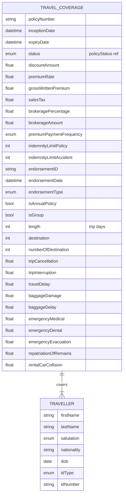

### Field annotations (Module 4)

| Entity | Field | Type | OPIN source | Notes |
|---|---|---|---|---|
| TravelCoverage | isAnnualPolicy | Boolean | sheet `travelCoverage` | False = single trip |
| TravelCoverage | isGroup | Boolean | sheet `travelCoverage` |  |
| TravelCoverage | length | Number/integer | sheet `travelCoverage` | Trip days |
| TravelCoverage | destination | Number/integer | sheet `travelCoverage` | OPIN types as integer; assumed to be a destination code |
| TravelCoverage | numberOfDestination | Number/integer | sheet `travelCoverage` | For multi-leg trips |
| TravelCoverage | tripCancellation | Number/Float | sheet `travelCoverage` | OPIN does not declare a type; normalised to Number/Float |
| TravelCoverage | tripInterruption | Number/Float | sheet `travelCoverage` | OPIN does not declare a type |
| TravelCoverage | travelDelay | Number/Float | sheet `travelCoverage` | OPIN does not declare a type |
| TravelCoverage | baggageDamage | Number/Float | sheet `travelCoverage` | OPIN does not declare a type |
| TravelCoverage | baggageDelay | Number/Float | sheet `travelCoverage` | OPIN does not declare a type |
| TravelCoverage | emergencyMedical | Number/Float | sheet `travelCoverage` | OPIN does not declare a type |
| TravelCoverage | emergencyDental | Number/Float | sheet `travelCoverage` | OPIN does not declare a type |
| TravelCoverage | emergencyEvacuation | Number/Float | sheet `travelCoverage` | OPIN does not declare a type |
| TravelCoverage | repatriationOfRemains | Number/Float | sheet `travelCoverage` | OPIN does not declare a type |
| TravelCoverage | rentalCarCollision | Number/Float | sheet `travelCoverage` | OPIN does not declare a type |
| Traveller | firstName | Text | sheet `traveller` |  |
| Traveller | lastName | Text | sheet `traveller` |  |
| Traveller | salutation | enum (salutation) | sheet `traveller` |  |
| Traveller | nationality | Text (ISO 3166-1 alpha-2) | sheet `traveller` |  |
| Traveller | dob | Date | sheet `traveller` |  |
| Traveller | idType | enum (idType) | sheet `traveller` |  |
| Traveller | idNumber | Text | sheet `traveller` |  |

`[OPIN concern]`: The benefit-limit fields on `travelCoverage` (`tripCancellation`, `tripInterruption`, `travelDelay`, `baggageDamage`, `baggageDelay`, `emergencyMedical`, `emergencyDental`, `emergencyEvacuation`, `repatriationOfRemains`, `rentalCarCollision`) are declared without explicit data types in the OPIN XLSX. `[OPIN-VN normalisation]` types all to `Number/Float` for consistency with other coverage modules. Upstream candidate.

`[OPIN concern]`: `Traveller` does not include address or contact fields. Travel coverage commonly requires emergency contact details and a delivery address for documents; OPIN is silent here. Upstream candidate.

---

## Module 5: Term Life

Covers term life insurance: termLifeCoverage with sum insured, free cover limit, term type, and riders; lifeInsured party including occupation and annual salary.

OPIN sources: `termLifeCoverage`, `lifeInsured`, `termLifeType`, `termLifeRiders`.

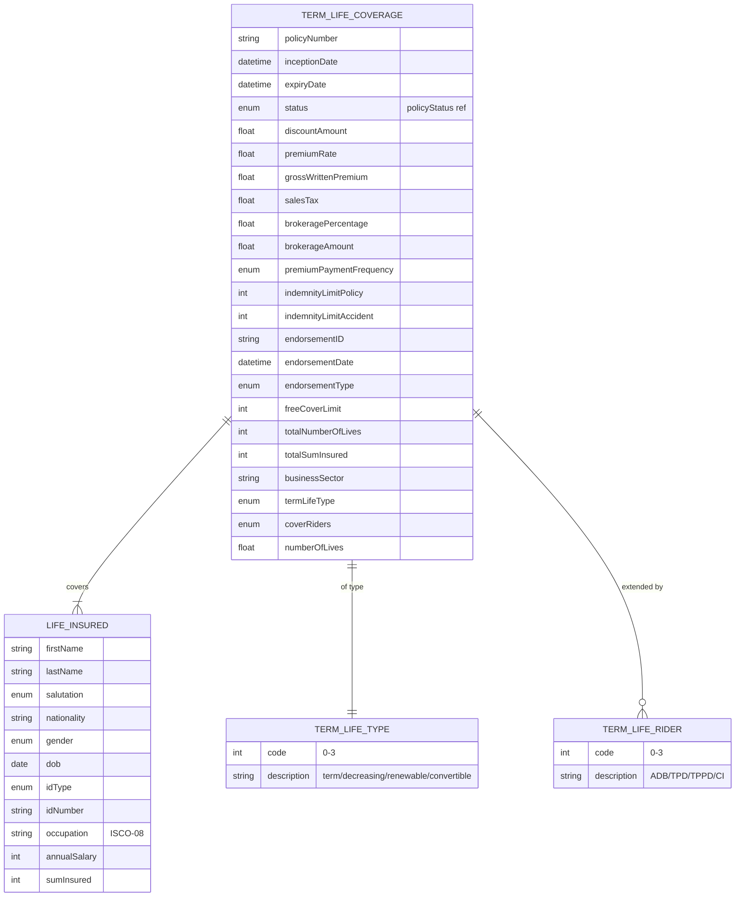

### Field annotations (Module 5)

| Entity | Field | Type | OPIN source | Notes |
|---|---|---|---|---|
| TermLifeCoverage | freeCoverLimit | Number/integer | sheet `termLifeCoverage` | Non-medical limit |
| TermLifeCoverage | totalNumberOfLives | Number/integer | sheet `termLifeCoverage` | Group policies; OPIN spelling `totalNumberiOfLives`; `[OPIN-VN normalisation]` applied |
| TermLifeCoverage | totalSumInsured | Number/integer | sheet `termLifeCoverage` |  |
| TermLifeCoverage | businessSector | Text (UK SIC) | sheet `termLifeCoverage` | OPIN does not declare type or reference; normalised to Text/UK SIC for consistency with Commercial.occupation |
| TermLifeCoverage | termLifeType | enum (termLifeType) | sheet `termLifeType` | XLSX: 4 values (Term life, Decreasing term, Renewable term, Convertible term) |
| TermLifeCoverage | coverRiders | enum multi (termLifeRiders) | sheet `termLifeRiders` | XLSX: 4 values (ADB, TPD, TPPD, Critical illness) |
| TermLifeCoverage | numberOfLives | Number/Float | sheet `termLifeCoverage` |  |
| LifeInsured | annualSalary | Number/integer | sheet `lifeInsured` | Underwriting input |
| LifeInsured | sumInsured | Number/integer | sheet `lifeInsured` | Death benefit |
| LifeInsured | address | ref (address) | sheet `lifeInsured` | Place of residence |
| LifeInsured | occupation | Text (ISCO-08) | sheet `lifeInsured` |  |

`[OPIN concern]`: `businessSector` on `termLifeCoverage` is listed without a type or a reference column in the XLSX. The likely intent is UK SIC (matching `Commercial.occupation` and `business.businessSector`). `[OPIN-VN normalisation]` types as `Text` with UK SIC reference. Upstream candidate to declare explicitly.

`[OPIN concern]`: `termLifeType` and `termLifeRiders` enum values diverge between the OPIN data standard XLSX and the OPIN API JSON.
  - XLSX `termLifeType` has 4 values: `Term life`, `Decreasing term`, `Renewable term`, `Convertible term`.
  - API JSON `termLifeType` has 3 values: `Term life`, `Decreasing term`, `Renewable term` (Convertible missing).
  - XLSX `termLifeRiders` has 4 values: `Accidental death benefit`, `Total permanent disability`, `Total and partial permanent disability`, `Critical illness`.
  - API JSON `termLifeRiders` has 5 values: the XLSX 4 plus `Convertible term` (which conceptually belongs in `termLifeType`, not in riders).
  
  This document treats the XLSX as authoritative: `termLifeType` is the 4-value set including `Convertible term`; `termLifeRiders` is the 4-value set without `Convertible term`. A future v1.0 of this track must resolving this upstream with the OPIN initiative.

`[OPIN concern]`: `Beneficiary` is not explicitly linked from `termLifeCoverage` in the OPIN sheet, although the universal `Beneficiary` entity exists in Module 1. Term life is the canonical case for beneficiary designation. Upstream candidate to formalise the link.

---

## Module 6: Property

Covers property insurance: propertyCoverage with sum insured for building/content/fixtures, deductibles, and perils; property entity with address, GPS, construction, type, and unit-level details.

OPIN sources: `propertyCoverage`, `property`, `propertyType` (~250 values), `propertyPeril` (~37 values), `wallConstruction` (~40 values), `roofConstruction` (~30 values).

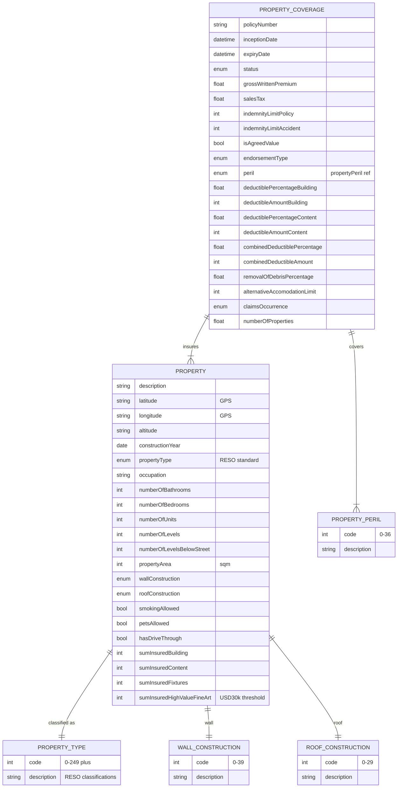

### Field annotations (Module 6)

| Entity | Field | Type | OPIN source | Notes |
|---|---|---|---|---|
| PropertyCoverage | indemnityLimitPolicy | Number/integer | sheet `propertyCoverage` | Annual policy limit |
| PropertyCoverage | isAgreedValue | Boolean | sheet `propertyCoverage` | True = agreed, false = market |
| PropertyCoverage | deductibleAmountBuilding | Number/integer | sheet `propertyCoverage` |  |
| PropertyCoverage | deductibleAmountContent | Number/integer | sheet `propertyCoverage` |  |
| PropertyCoverage | combinedDeductibleAmount | Number/integer | sheet `propertyCoverage` |  |
| PropertyCoverage | removalOfDebrisPercentage | Number/Float | sheet `propertyCoverage` | Limit any one claim |
| PropertyCoverage | alternativeAccomodationLimit | Number/integer | sheet `propertyCoverage` | OPIN spelling `alternativeAccomodation` (single 'm'); preserved here |
| PropertyCoverage | claimsOccurrence | enum (claimsOccurrence) | sheet `claimsOccurrence` | OPIN sheet types as Boolean on `propertyCoverage`; `[OPIN-VN normalisation]` uses the two-value enum sheet |
| Property | propertyType | enum (propertyType) | sheet `propertyType` | RESO standard, ~250 enumerated property types |
| Property | wallConstruction | enum (wallConstruction) | sheet `wallConstruction` | ~40 values |
| Property | roofConstruction | enum (roofConstruction) | sheet `roofConstruction` | ~30 values |
| Property | sumInsuredHighValueFineArt | Number/integer | sheet `property` | Items > USD 30,000 |

`[OPIN concern]`: `propertyCoverage.claimsOccurrence` is typed Boolean on the `propertyCoverage` sheet, but the standalone `claimsOccurrence` enum sheet defines two semantic values (`Claims occurring`, `Claims made`). The Boolean form drops semantic clarity. `[OPIN-VN normalisation]` uses the enum.

`[OPIN concern]`: The `property` sheet contains a duplicated field name: `numberOfBedrooms` is listed twice. The first row's description (`total number of bathrooms`) makes clear the first occurrence is intended to be `numberOfBathrooms`. `[OPIN-VN normalisation]` renders as `numberOfBathrooms` and `numberOfBedrooms`.

`[OPIN concern]`: The OPIN API JSON spells the roof construction enum as `rootConstruction`, while the XLSX correctly uses `roofConstruction`. The XLSX is authoritative. `[OPIN-VN normalisation]` uses `roofConstruction`. A future v1.0 of this track must reporting the API typo upstream.

`[OPIN concern]`: The `property` sheet field `occcupation` (three c's) is misspelled (should be `occupation`). `[OPIN-VN normalisation]` applied.

---

## Module 7: Cyber Liability

Covers cyber liability insurance: cyberLiabilityCoverage at policy level; business entity with sector, data assets profile, IT staff and online turnover; coverage categories from a 21-value taxonomy spanning data loss, breach response, business interruption, ransomware, fines.

OPIN sources: `cyberLiabilityCoverage`, `business`, `dataAssets`, `cyberCoverageCategories`.

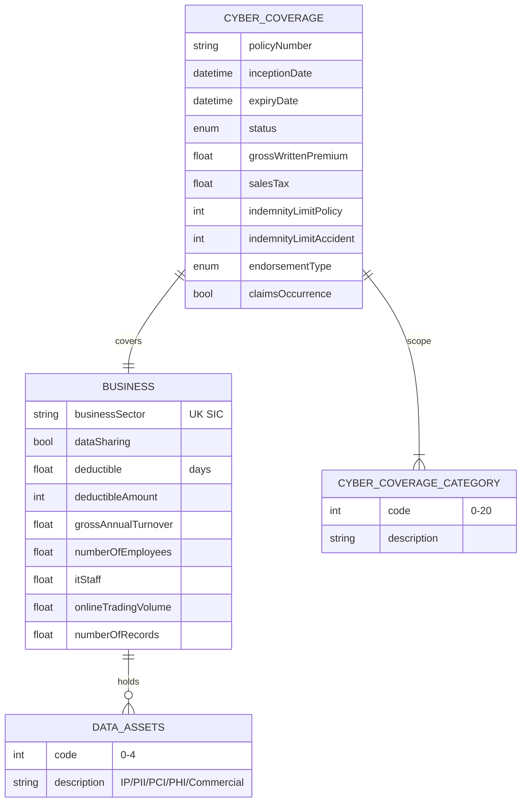

### Field annotations (Module 7)

| Entity | Field | Type | OPIN source | Notes |
|---|---|---|---|---|
| CyberLiabilityCoverage | claimsOccurrence | Boolean | sheet `cyberLiabilityCoverage` | OPIN spelling `claimsOcuurence` on this sheet; `[OPIN-VN normalisation]` applied. Note Boolean here, separate from the `claimsOccurrence` enum used on Module 6 and Module 8 |
| Business | businessSector | UK SIC | sheet `business` |  |
| Business | dataAssets | enum multi (dataAssets) | sheet `dataAssets` | IP / PII / PCI / PHI / Commercial |
| Business | dataSharing | Boolean | sheet `business` | Third-party / cloud sharing |
| Business | itStaff | Number/Float | sheet `business` |  |
| Business | numberOfRecords | Number/Float | sheet `business` | Sensitive records held |
| Business | grossAnnualTurnover | Number/Float | sheet `business` |  |
| Business | NumberOfEmployees | Number/Float | sheet `business` | OPIN PascalCase; `[OPIN-VN normalisation]` to camelCase `numberOfEmployees` |
| Business | onlineTradingVolume | Number/Float | sheet `business` |  |
| CyberCoverageCategory | code | int | sheet `cyberCoverageCategories` | 21 categories: data loss, breach privacy, incident mgmt, K&R, BI, contingent BI, multi-media liability, legal/defence, reputation, network failure, E&O, professional indemnity, fidelity, IP theft, asset damage, compensation, terrorism, fines, D&O, GL, environmental |
| DataAssets | code | int | sheet `dataAssets` | 0-4: IP, PII, PCI, PHI, Commercial |

`[OPIN concern]`: The `business` sheet's `cyberCoverageCategories` field references the `cyberLiabilityCoverage` sheet rather than the `cyberCoverageCategories` enum sheet. This is a sheet-level reference error. `[OPIN-VN normalisation]` corrects the reference to point to the `cyberCoverageCategories` enum.

`[OPIN concern]`: The `cyberLiabilityCoverage.claimsOcuurence` field name has two typos (`Ocuurence` should be `Occurrence`). `[OPIN-VN normalisation]` renders as `claimsOccurrence`.

`[OPIN concern]`: `cyberCoverageCategories` enum descriptions contain typos: `Multi-media laibilities`, `Theft of intectual property`. Codes are stable; descriptions can be normalised.

Out-of-scope for OPIN: cyber incident lifecycle entities (incident detection, breach notification timelines, remediation activities). OPIN's cyber model captures pre-loss exposure and coverage scope only. Incident response workflow is a domain extension, not modelled here.

---

## Module 8: Business Interruption

Covers BI insurance: extended property-style policy with profit/turnover/payroll exposure base, ICOW, contingent loss, denial of access, and indemnity period; references propertyType and propertyPeril.

OPIN sources: `businessInterruptionCoverage`, `typeBusinessInterruption`, `claimsOccurrence`.

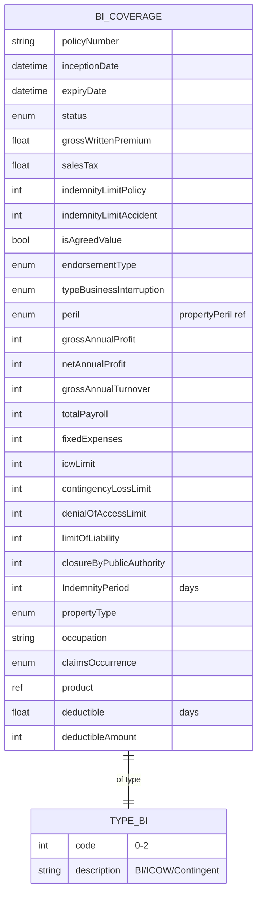

### Field annotations (Module 8)

| Entity | Field | Type | OPIN source | Notes |
|---|---|---|---|---|
| BICoverage | typeBusinessInterruption | enum (typeBusinessInterruption) | sheet `typeBusinessInterruption` | BI / ICOW / Contingent Loss of Profit |
| BICoverage | grossAnnualProfit | Number/integer | sheet `businessInterruptionCoverage` |  |
| BICoverage | netAnnualProfit | Number/integer | sheet `businessInterruptionCoverage` |  |
| BICoverage | grossAnnualTurnover | Number/integer | sheet `businessInterruptionCoverage` |  |
| BICoverage | totalPayroll | Number/integer | sheet `businessInterruptionCoverage` |  |
| BICoverage | fixedExpenses | Number/integer | sheet `businessInterruptionCoverage` |  |
| BICoverage | icwLimit | Number/integer | sheet `businessInterruptionCoverage` | Increased Cost of Working |
| BICoverage | contingencyLossLimit | Number/integer | sheet `businessInterruptionCoverage` |  |
| BICoverage | denialOfAccessLimit | Number/integer | sheet `businessInterruptionCoverage` |  |
| BICoverage | limitOfLiability | Number/integer | sheet `businessInterruptionCoverage` | Annual policy limit |
| BICoverage | closureByPublicAuthority | Number/integer | sheet `businessInterruptionCoverage` | OPIN field name `closure by public authority` (with spaces); `[OPIN-VN normalisation]` to camelCase |
| BICoverage | IndemnityPeriod | Number/integer | sheet `businessInterruptionCoverage` | Days; OPIN PascalCase preserved here as it is the only PascalCase field in this entity |
| BICoverage | claimsOccurrence | enum (claimsOccurrence) | sheet `claimsOccurrence` |  |
| BICoverage | propertyType | enum (propertyType) | sheet `businessInterruptionCoverage` | Reused from Module 6 |
| BICoverage | product | ref (Product) | sheet `businessInterruptionCoverage` | Cross-reference to product entity |

`[OPIN concern]`: `closure by public authority` field name in OPIN contains spaces, which break naming conventions used elsewhere. `[OPIN-VN normalisation]` to `closureByPublicAuthority`. Upstream candidate.

`[OPIN concern]`: `businessInterruptionCoverage` types most numeric fields as `Number/fFloat` (lower-f typo for `Float`). `[OPIN-VN normalisation]` renders as `Number/Float`. Upstream candidate.

`[OPIN concern]`: BI coverage typically attaches to a Property; OPIN does not declare an explicit foreign key from `businessInterruptionCoverage` to `property`. A `propertyRef` would tighten the model. Upstream candidate.

---

## Module 9: Trade Credit

Covers trade credit insurance: tradeCreditCoverage with debtor-specific limits, deductibles, sectors, and waiting periods; debtor entity with parent company, financials, credit rating; coverage type enum (Whole Turnover, Key Accounts, Single Buyer, Transactional).

OPIN sources: `tradeCreditCoverage`, `debtor`, `tradeCreditTpe` (sheet name typo), `tradeCreditPeril`, `legalEntity`.

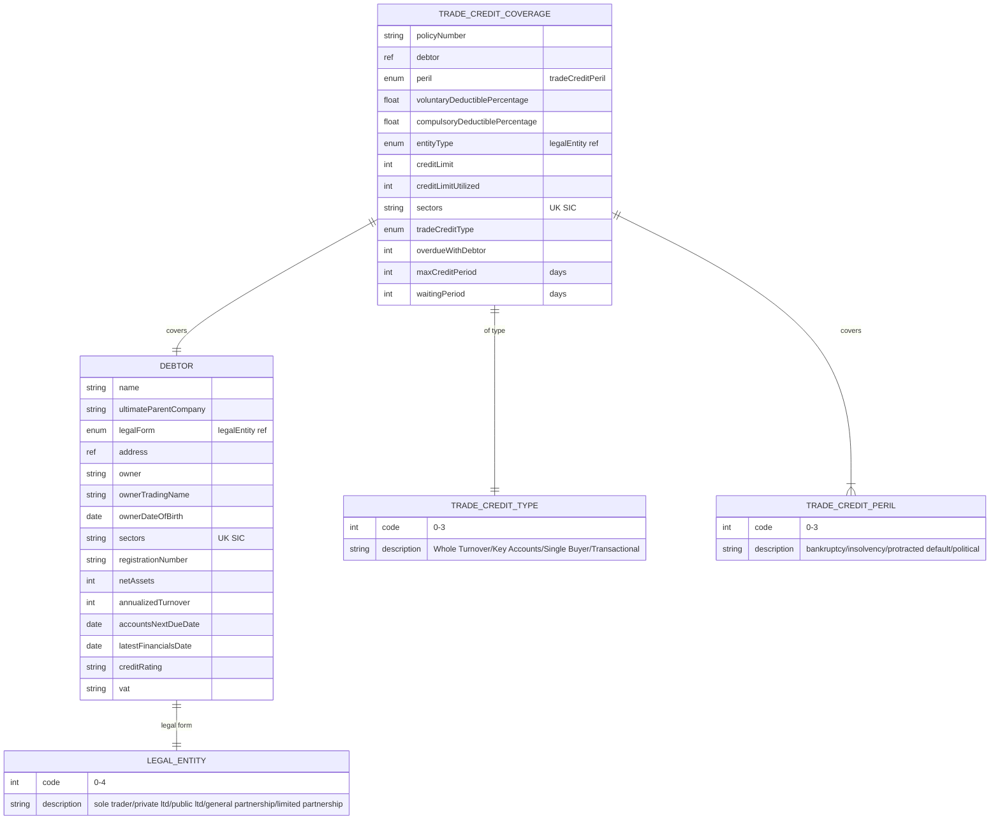

### Field annotations (Module 9)

| Entity | Field | Type | OPIN source | Notes |
|---|---|---|---|---|
| TradeCreditCoverage | debtor | ref (Debtor) | sheet `tradeCreditCoverage` |  |
| TradeCreditCoverage | tradeCreditType | enum (tradeCreditType) | sheet `tradeCreditTpe` | OPIN sheet name `tradeCreditTpe` is a typo; `[OPIN-VN normalisation]` to `tradeCreditType` |
| TradeCreditCoverage | creditLimit | Number/integer | sheet `tradeCreditCoverage` |  |
| TradeCreditCoverage | creditLimitUtilized | Number/integer | sheet `tradeCreditCoverage` | OPIN spelling `creditLimitUtiilized` (double-i); `[OPIN-VN normalisation]` applied |
| TradeCreditCoverage | maxCreditPeriod | Number/integer | sheet `tradeCreditCoverage` | Days |
| TradeCreditCoverage | waitingPeriod | Number/integer | sheet `tradeCreditCoverage` |  |
| TradeCreditCoverage | overdueWithDebtor | Number/integer | sheet `tradeCreditCoverage` |  |
| TradeCreditCoverage | sectors | Text (UK SIC) | sheet `tradeCreditCoverage` |  |
| TradeCreditCoverage | entitytype | enum (legalEntity) | sheet `tradeCreditCoverage` | OPIN field name `entitytype` (lowercase t); `[OPIN-VN normalisation]` to `entityType` |
| Debtor | ultimateParentCompany | Text | sheet `debtor` |  |
| Debtor | legalForm | enum (legalEntity) | sheet `debtor` |  |
| Debtor | netAssets | Number/integer | sheet `debtor` | Formula in OPIN: (Total Fixed Assets + Total Current Assets) - (Total Current Liabilities + Total Long Term Liabilities) |
| Debtor | annualizedTurnover | Number/integer | sheet `debtor` |  |
| Debtor | accountsNextDueDate | Date | sheet `debtor` |  |
| Debtor | latestFinancialsDate | Date | sheet `debtor` |  |
| Debtor | creditRating | Text | sheet `debtor` | S&P, AM Best, Fitch |

`[OPIN concern]`: `tradeCreditCoverage` is missing the standard policy lifecycle fields that every other coverage carries: `inceptionDate`, `expiryDate`, `status`, `discountAmount`, `premiumRate`, `grossWrittenPremium`, `salesTax`, `brokeragePercentage`, `brokerageAmount`, `premiumPaymentFrequency`, `endorsementID`, `endorsementDate`, `endorsementType`. These are required for any policy and their absence makes the trade credit coverage entity inconsistent with the rest of the OPIN model. Upstream candidate to add.

`[OPIN concern]`: OPIN sheet name `tradeCreditTpe` is a typo (should be `tradeCreditType`). `[OPIN-VN normalisation]` applies the corrected spelling but the original sheet name is flagged here for upstream report.

`[OPIN concern]`: OPIN field `creditLimitUtiilized` on `tradeCreditCoverage` is misspelled (double-i, should be `creditLimitUtilized`). `[OPIN-VN normalisation]` applied.

`[OPIN concern]`: `tradeCreditPeril` includes `political risks` (code 3), which overlaps with broader political risk insurance products in `productCatalog`. The line between trade credit and political risk insurance is not clean in OPIN. Upstream candidate to clarify scope.

---

## Module 10: Pet

Covers pet insurance: petCoverage with reimbursement, deductible, waiting period, and pre-existing conditions flag; pet entity with kind (cat, dog, bird, exotic, rabbit, 5 values per OPIN), age, size, purebred flag; breed (dog breeds only in OPIN, ~320 values); petBenefits taxonomy (38 values across veterinary, surgical, diagnostic, preventive, behavioural).

OPIN sources: `petCoverage`, `pet`, `petBenefits`, `petBreed`, `petKind`.

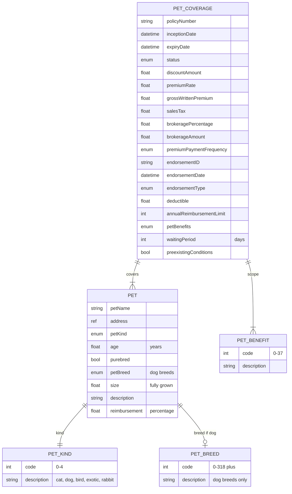

### Field annotations (Module 10)

| Entity | Field | Type | OPIN source | Notes |
|---|---|---|---|---|
| PetCoverage | annualReimbursementLimit | Number/integer | sheet `petCoverage` |  |
| PetCoverage | waitingPeriod | Number/integer | sheet `petCoverage` | Days before coverage active |
| PetCoverage | preexistingConditions | Boolean | sheet `petCoverage` |  |
| PetCoverage | deductible | Number/Float | sheet `petCoverage` | Percentage of each claim |
| Pet | petKind | enum (petKind) | sheet `petKind`, API enum `petKind` | 5 values: cat, dog, bird, exotic, rabbit |
| Pet | petBreed | enum (petBreed) | sheet `petBreed`, API enum `petBreed` | ~320 values, dog breeds only |
| Pet | reimbursement | Number/Float | sheet `pet` | Percentage of admitted claim |
| Pet | size | Number/Float | sheet `pet` | Expected size when fully grown (dogs) |
| Pet | address | ref (address) | sheet `pet` | Place of residence of pet |
| PetBenefit | code | int | sheet `petBenefits` | 38 values |

`[OPIN concern]`: `petKind` covers cat, dog, bird, exotic, and rabbit (5 values). However, `petBreed` enumerates dog breeds only (~320 entries). Cat, rabbit, bird, and exotic-pet breed-level enumerations are not in OPIN. The result is that breed-level data exists for one of the five kinds. Upstream candidate to either drop breed for non-dog kinds explicitly, add per-kind breed enumerations, or model breed as a free-text fallback.

`[OPIN concern]`: `petCoverage` is missing the per-occurrence indemnity limit field (`indemnityLimitAccident`) that other coverages carry. `annualReimbursementLimit` may be acting as the policy limit, but the relationship to per-occurrence claims is ambiguous. Upstream candidate.

`[OPIN concern]`: `petCoverage` types `deductible` as `Number/fFloat` (typo). `[OPIN-VN normalisation]` to `Number/Float`. The same lower-f typo appears across multiple sheets (`businessInterruptionCoverage`, `tradeCreditCoverage`, `pet`, `petCoverage`).

---

## Module 11: Claims

Covers the claims lifecycle: Claim entity with FNOL, loss date, type, location, liability share, reserve, status, payments; ClaimsBordereau for reinsurance reporting; claimsOccurrence basis (occurring vs made); claim type and status enums.

OPIN sources: `Claim`, `ClaimsBordereau`, `claimsOccurrence`, `claimType`, `claimStatus`.

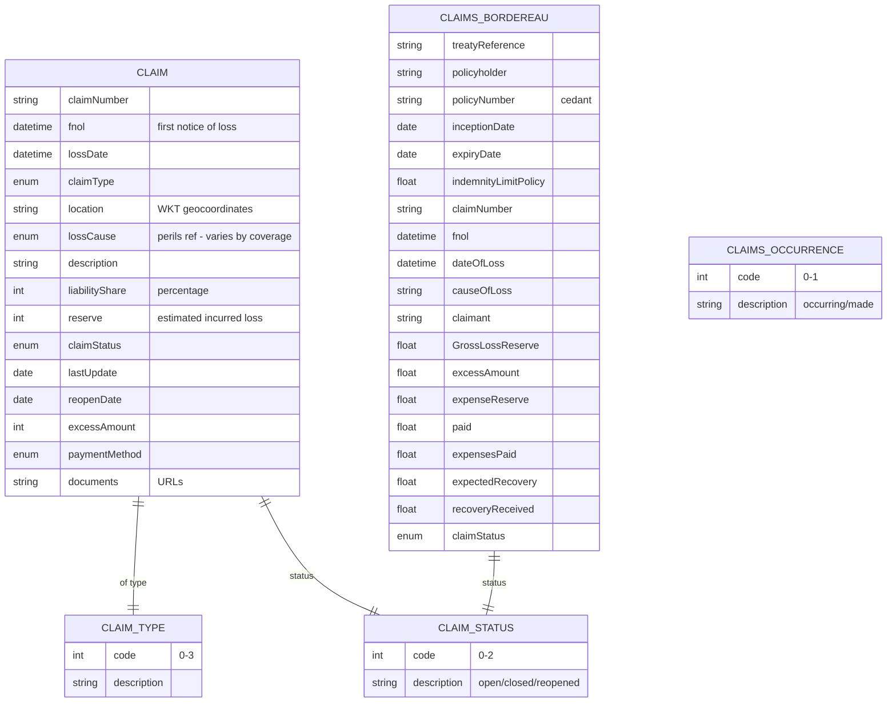

### Field annotations (Module 11)

| Entity | Field | Type | OPIN source | Notes |
|---|---|---|---|---|
| Claim | claimNumber | Text | sheet `Claim` |  |
| Claim | fnol | DateTime (ISO 8601) | sheet `Claim` | First notice of loss |
| Claim | lossDate | DateTime (ISO 8601) | sheet `Claim` |  |
| Claim | claimType | enum (claimType) | sheet `claimType` | Own property / 3PL bodily / 3PL property / other |
| Claim | location | Text (WKT geo) | sheet `Claim` |  |
| Claim | lossCause | enum (perils, polymorphic) | sheet `Claim` | OPIN references `perils` (lowercase, plural) without specifying the peril enum |
| Claim | liabilityShare | Number/integer | sheet `Claim` | Percentage |
| Claim | reserve | Number/integer | sheet `Claim` | Inclusive of expenses |
| Claim | claimStatus | enum (claimStatus) | sheet `claimStatus` | Open / closed / reopened |
| Claim | lastUpdate | Date | sheet `Claim` |  |
| Claim | reopenDate | Date | sheet `Claim` |  |
| Claim | excessAmount | Number/integer | sheet `Claim` | Deductible |
| Claim | paymentMethod | enum (paymentMethod) | sheet `Claim` |  |
| Claim | documents | Text/URL | sheet `Claim` | Police report, photos, etc. |
| ClaimsBordereau | treatyReference | Text | sheet `ClaimsBordereau` | Reinsurance treaty |
| ClaimsBordereau | GrossLossReserve | Number/Float | sheet `ClaimsBordereau` | OPIN typo `GrosslLossReserve` (lowercase l between Gross and Loss); `[OPIN-VN normalisation]` applied |
| ClaimsBordereau | expectedRecovery | Number/Float | sheet `ClaimsBordereau` | Salvage estimate |
| ClaimsBordereau | recoveryReceived | Number/Float | sheet `ClaimsBordereau` |  |
| ClaimsBordereau | dateOfLoss | DateTime (ISO 8601) | sheet `ClaimsBordereau` |  |
| ClaimsBordereau | causeOfLoss | Text | sheet `ClaimsBordereau` | Free-text on bordereau, vs `lossCause` enum on Claim |

`[OPIN concern]`: `Claim.lossCause` references a generic `perils` (lowercase, plural) without specifying which peril enum (`motorPeril`, `propertyPeril`, `tradeCreditPeril`). The intended resolution appears to be polymorphic by coverage type, but OPIN does not declare this. Upstream candidate to define `lossCause` resolution explicitly.

`[OPIN concern]`: The `Claim` entity has no explicit foreign key back to a `Coverage` (or any coverage type) or to a policy identifier. The relationship is only inferable from `claimNumber`/`policyNumber` correlation maintained by the cedant. Upstream candidate to add explicit `coverageRef` or `policyNumber` field.

`[OPIN concern]`: `ClaimsBordereau.GrosslLossReserve` field name is misspelled (extra `l` between `Gross` and `Loss`). `[OPIN-VN normalisation]` applied.

`[OPIN concern]`: `Claim` has no field for cumulative `paid` to date (cumulative claim payments). `ClaimsBordereau` has `paid` for reinsurance reporting, but the direct-insurance Claim entity carries only `reserve`. Reconciling reserve to paid-out requires this field. Upstream candidate.

Out-of-scope for OPIN: claim sub-states beyond open/closed/reopened (such as intake, triage, in-investigation, awaiting-documents, awaiting-payment, settled-pending-recovery, voided), claim-event audit trails, and multi-actor claim workflow. These are operational extensions not modelled by OPIN.

---

## Module 12: Premium and Receipts

Covers payment lifecycle: Receipt for transactions of any type (new policy, renewal, MTA, claim payment, brokerage, profit share); PremiumBordereau for reinsurance premium reporting; receiptType, receiptCalculation enums.

OPIN sources: `Receipt`, `PremiumBordereau`, `receiptType`, `receiptCalculation`, `paymentMethod`.

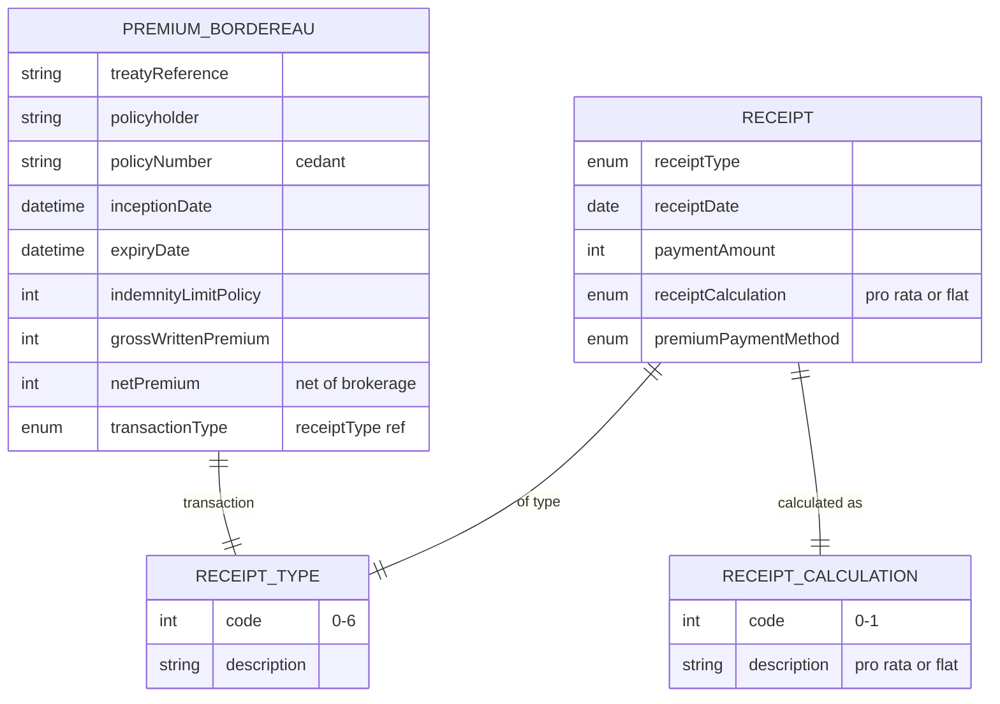

### Field annotations (Module 12)

| Entity | Field | Type | OPIN source | Notes |
|---|---|---|---|---|
| Receipt | receiptType | enum (receiptType) | sheet `receiptType` | new / renewal / MTA / claim payment / brokerage / profit share / other |
| Receipt | receiptDate | Date | sheet `Receipt` |  |
| Receipt | paymentAmount | Number/integer | sheet `Receipt` |  |
| Receipt | receiptCalculation | enum (receiptCalculation) | sheet `receiptCalculation` | Pro rata or flat |
| Receipt | premiumPaymentMethod | enum (paymentMethod) | sheet `paymentMethod` |  |
| PremiumBordereau | treatyReference | Text | sheet `PremiumBordereau` | Reinsurance treaty ref |
| PremiumBordereau | grossWrittenPremium | Number/integer | sheet `PremiumBordereau` | Pre-tax |
| PremiumBordereau | netPremium | Number/integer | sheet `PremiumBordereau` | After brokerage |
| PremiumBordereau | transactionType | enum (receiptType) | sheet `PremiumBordereau` | New / renewal / mid-term adjustment |

`[OPIN concern]`: `Receipt` lacks linkage fields to a Policy or Claim. There is no `policyNumber`, `policyRef`, or `claimNumber` on the Receipt entity. Reconciliation between cash-in/cash-out and the policy or claim that originated the transaction therefore cannot be performed using OPIN fields alone. Upstream candidate to add `policyRef` (required for new/renewal/MTA/brokerage/profit-share) and `claimRef` (required for claim payment).

`[OPIN concern]`: OPIN publishes `PremiumBordereau` and `ClaimsBordereau` for reinsurance reporting but does not publish a corresponding direct-insurance premium ledger entity. Reconciling premium accruals, collections, and remittances at the direct-insurance level is not supported by OPIN. Upstream candidate.

Out-of-scope for OPIN: commission ledgers, payout schedules to distribution partners, and microinsurance distribution-channel revenue splits. These are operational concerns not in OPIN's scope.

---

## Cross-module relationships (composite view)

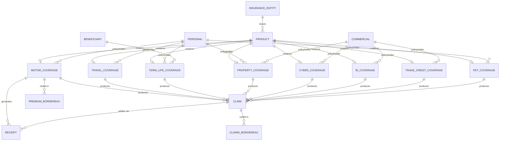

The composite view shows OPIN's coverage-centric model: Product instantiates one of the eight coverage types, Personal or Commercial parties act as policyholders, Beneficiary attaches at policy level (canonically term life), Claim arises from any coverage, Receipt records the cash leg, and PremiumBordereau/ClaimsBordereau are reinsurance-side reports. The associations marked here for Claim and Receipt are conceptual; OPIN does not declare the foreign keys (see Module 11 and Module 12 OPIN concerns).

---

## Open OPIN questions

These are inconsistencies and gaps in the OPIN v1.2.1 standard itself. They should be resolved upstream with the OPIN initiative as part of a future v1.0 of this track. The list excludes architectural choices that an implementer makes (such as whether to introduce a Policy aggregate root or a Coverage abstract base) and excludes domain extensions outside insurance proper (event streams, telematics ingestion, distribution channels). Those are downstream concerns for product designers, not OPIN issues.

1. **`termLifeType` and `termLifeRiders` XLSX vs API divergence.** XLSX `termLifeType` has 4 values; API has 3. XLSX `termLifeRiders` has 4 values; API has 5 (the API adds `Convertible term`, which conceptually belongs in `termLifeType`). Resolve which side is authoritative and align both.

2. **`rootConstruction` vs `roofConstruction` API typo.** API JSON spells the roof construction enum as `rootConstruction`; XLSX correctly uses `roofConstruction`. Fix in API.

3. **`propertyCoverage.claimsOccurrence` Boolean vs enum.** Field is typed Boolean on `propertyCoverage`, but a standalone two-value `claimsOccurrence` enum sheet exists. Choose one form across the standard.

4. **`property` sheet duplicate field name.** `numberOfBedrooms` listed twice; one occurrence is intended to be `numberOfBathrooms` per its description.

5. **`tradeCreditTpe` sheet name typo.** Should be `tradeCreditType`.

6. **`tradeCreditCoverage.creditLimitUtiilized` field name typo.** Should be `creditLimitUtilized`.

7. **`tradeCreditCoverage` missing standard policy lifecycle fields.** Unlike every other coverage entity, `tradeCreditCoverage` does not carry `inceptionDate`, `expiryDate`, `status`, premium fields, brokerage fields, or endorsement fields. Add them.

8. **`business.cyberCoverageCategories` reference points to wrong sheet.** Field references the `cyberLiabilityCoverage` sheet rather than the `cyberCoverageCategories` enum sheet.

9. **`businessInterruptionCoverage.closure by public authority` field name contains spaces.** Normalise to a single-token field name.

10. **`Vehicle` entity bundles 100+ fields across registration, OEM specs, telematics, ADAS, condition, and consent.** Operationally large for a single record. Consider whether OPIN should split Vehicle into static and dynamic sub-entities.

11. **`petKind` covers 5 kinds but `petBreed` enumerates dogs only.** Cat, rabbit, bird, and exotic-pet breeds unmodelled. Either restrict breed to dogs explicitly, add per-kind breed enumerations, or specify a free-text fallback.

12. **`Claim` lacks an explicit foreign key to Coverage or Policy.** Inferred from `claimNumber`/`policyNumber` correlation. Add explicit reference.

13. **`Receipt` lacks `policyRef` and `claimRef` linkage fields.** Reconciliation requires these foreign keys. Add explicit references.

14. **`Claim.lossCause` references generic `perils` without specifying which peril enum.** Polymorphic resolution by coverage type is implied but not declared. Make explicit.

15. **`ClaimsBordereau.GrosslLossReserve` field name typo.** Should be `GrossLossReserve`.

16. **`policyWording` is a single-property entity (just `name`) without version control.** Compliance traceability for wording documents is not supported. Add `version`, `effectiveDate`, and document URL fields.

17. **`Personal.gender` enum is binary plus `other` (m / f / o).** Some jurisdictions require additional values or a different non-binary representation. Review for jurisdictional fit, including Vietnam.

18. **`Commercial` lacks a `legalForm` reference to the `legalEntity` enum.** Trade Credit's `Debtor` carries `legalForm`; the universal `Commercial` party does not. Add for consistency.

19. **Pervasive low-impact spelling errors across sheets.** `Number/fFloat` (lower-f) appears across multiple coverage sheets; `engnitionOn`/`engnitionOff`, `logitude`, `laneDepartureWarnning`, `decelrationRate`, `countryOfRegisteration`, `volcanic erruption`, `unkown or hit and run`, `Multi-media laibilities`, `Theft of intectual property`, `claimsOcuurence`, `medicalConditon`, `occcupation`, `redundnt`, `tracktor`, `sprinler leakage`, `Strom` (storm). Codes are stable; descriptions and field names should be cleaned up in a v1.2.2 patch.

20. **`Product.premiumPaymentFrequency` typed `Number/integer` but references the `premiumPaymentFrequency` enum.** Type-vs-reference inconsistency; choose one.

These are all genuine OPIN issues. Resolving them upstream is preferable to carrying `[OPIN-VN normalisation]` patches indefinitely. This list is published at `upstream/opin-concerns.md` in this repository for that purpose.
